# Predicting Obesity Levels Using Lifestyle, Eating Habits, and Physical Activity Patterns

## Project Overview
Obesity is a major public health challenge, contributing to an increased risk of chronic diseases such as diabetes, cardiovascular conditions, and metabolic disorders (Centers for Disease Control and Prevention [CDC], 2022; World Health Organization [WHO], 2023). Understanding the key lifestyle and dietary factors that contribute to obesity is crucial for designing effective, data-driven interventions to promote healthier living.

Using the *Estimation of Obesity Levels Based on Eating Habits and Physical Condition* dataset from the UCI Machine Learning Repository, this project aims to develop machine learning models that analyze the relationships between eating habits, physical activity, and lifestyle choices to predict obesity levels based on the NObesity classification system.

By identifying the most influential predictors of obesity, this model can help healthcare professionals, policymakers, and individuals make informed decisions about obesity prevention and intervention strategies.

## Research Question
**Which lifestyle and dietary habits contribute most to obesity?**

## Dataset Information
- **Source:** [UCI Machine Learning Repository](https://archive.ics.uci.edu/dataset/544/estimation+of+obesity+levels+based+on+eating+habits+and+physical+condition)
- **Description:** The dataset contains demographic information, eating habits, and physical condition indicators that help estimate obesity levels.
- **Dataset Features:**
  - Demographics: Age, Gender
  - Physical Conditions: Physical Conditions: Height, Weight, BMI (derived feature), Physical activity frequency (FAF)
  - Eating Habits: High-calorie food consumption (FAVC), Vegetable consumption (FCVC), Number of main meals per day (NCP), Eating between meals (CAEC)
  - Lifestyle Factors: Alcohol consumption frequency (CALC), Smoking (SMOKE), Water intake (CH2O), Screen time/technology usage (TUE), Transportation mode (MTRANS)
  - Health Indicators: Family history of overweight (family_history_with_overweight), Caloric monitoring (SCC)
  - Target Variable:  The NObesity Classification System categorizes obesity into the following levels:
      1.	Underweight
      2.	Normal weight
      3.	Overweight Type I
      2. Overweight Type II
      5.	Obesity Type I
      6.	Obesity Type II
      7.	Obesity Type III

## Stakeholders & Their Interest
**Primary Stakeholders:**
1. **Healthcare Professionals & Researchers** – Interested in understanding how lifestyle factors contribute to obesity.
2. **Public Health Organizations** – Can use insights to develop better awareness campaigns and preventive healthcare programs.
3. **Insurance & Policy Makers** – Obesity and its related health risks impact healthcare costs, so insights from this project can guide policy decisions.
4. **Fitness & Nutrition Industries** – Businesses in the health sector can leverage findings to develop personalized diet and exercise programs.
5. **Individuals Concerned About Health** – The general public can benefit from personalized risk assessments based on lifestyle habits.

## Can This Dataset Answer Our Research Question?
- **Yes.** The dataset provides demographic information, physical conditions, and lifestyle habits, which are relevant factors for obesity prediction.

## Value to the Industry
- **Healthcare** – Helps identify key lifestyle-related risk factors for obesity and prevention strategies.
- **Public Health & Policy** – Supports better policy-making for obesity-related health risks.
- **Fitness & Nutrition** – Enables data-driven recommendations for healthier living.

## Risks & Uncertainties
1. **Self-Reported Data** – Eating habits and physical activity are self-reported, introducing potential bias.
2. **Generalization Issues** – The dataset's population may not be fully representative of all demographics, limiting external validity.
3. **Feature Limitations** – Critical medical factors (e.g., blood pressure, cholesterol) affecting obesity risk are missing.

## Required Libraries & Tools
•	**Python**: Data processing & modeling.

•	**Pandas, NumPy**: Data handling & numerical operations.

•	**Matplotlib & Seaborn**: Data & results visualization.

•	**Scikit-Learn**:
- Machine learning models (Logistic Regression, Decision Trees, Random Forest, KNN).
- Feature selection (finding the most important predictors). 
- Cross-validation & hyperparameter tuning (improving accuracy).


## Methodology
1. **Data Preprocessing**
   - Addressed missing values, outliners and inconsistancies in the dataset. 
   - Converted categorical variables to numerical representations
   - Standardized numerical features
2. **Exploratory Data Analysis (EDA)**
   - Created visualizations of feature distributions including histograms to identify outliers, class imbalances and skewness. 
   - Identified correlations between variables
3. **Feature Engineering**
   - Create new relevant features based on existing data
   - Perform dimensionality reduction (if needed)
4. **Model Selection & Training**
   - Apply classification models (e.g., Logistic Regression, Random Forest)
   - Tune hyperparameters for optimal performance
   - Evaluate using metrics like Accuracy, Precision, Recall, and F1-Score
5. **Interpretation & Insights**
   - Identify the most significant factors influencing obesity levels
   - Compare model performance
   - Discuss potential real-world applications

## Data Visualization

We conducted a comprehensive visualization analysis to understand how different features relate to obesity levels [here](reports/visualization.ipynb), the results of which are summarized below:

### Numerical Feature Analysis

#### Weight Distribution
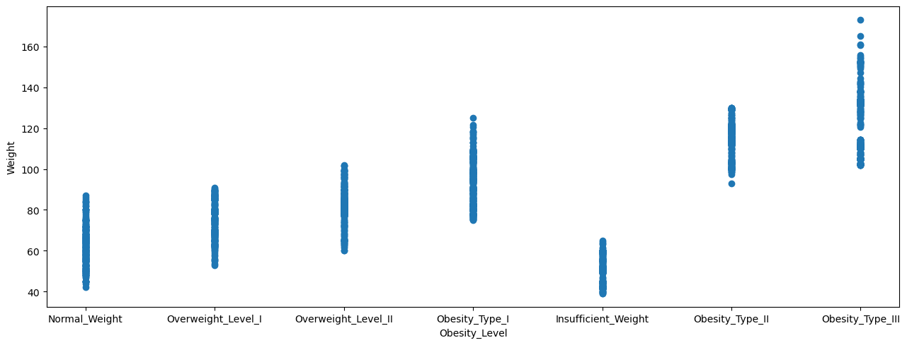

#### Age and Height Distribution
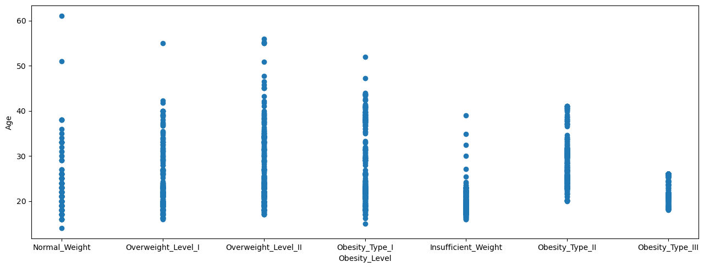
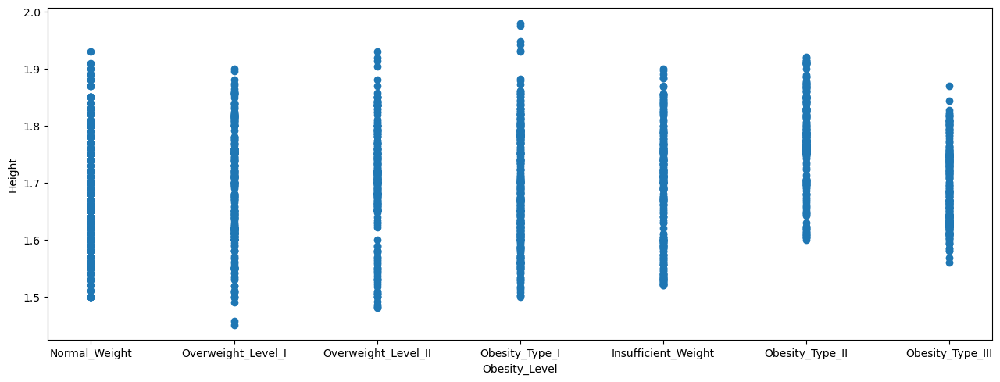

#### Lifestyle Factors
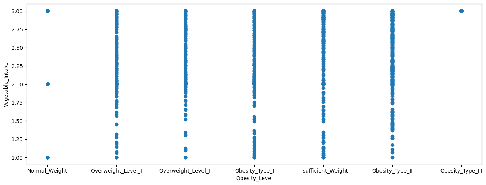

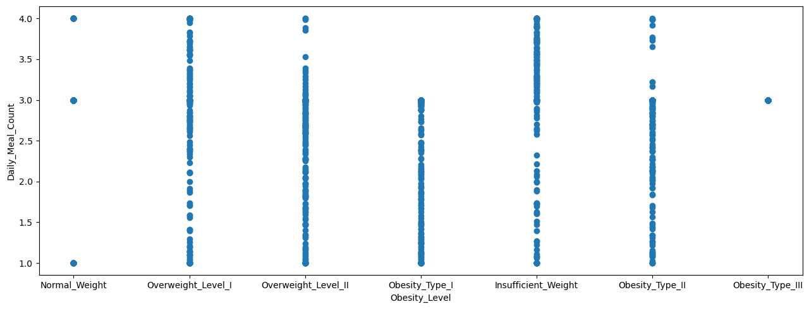

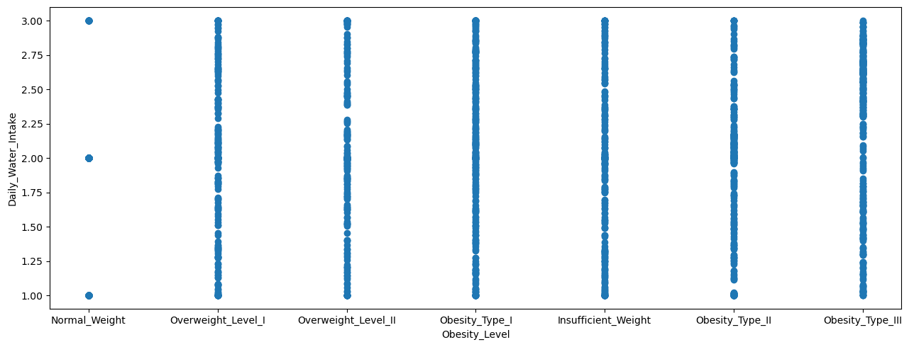

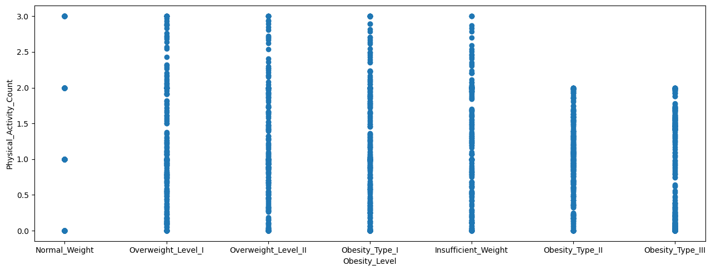

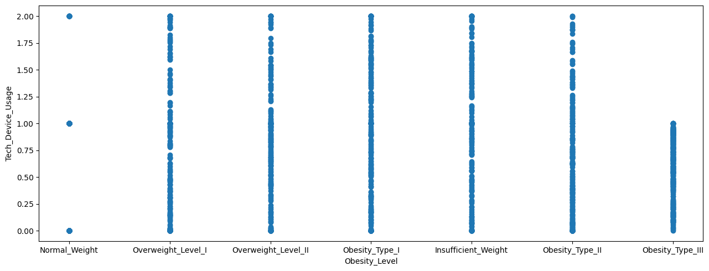

**Key Findings from Numerical Variables:**

1. **Weight**:
   - Clear progressive increase across obesity level categories, validating the classification
   - Distinct weight ranges for each category with minimal overlap
   - Weight showed the strongest association with obesity level (expected given its role in classification)
   - Obesity Type III showed the widest range (120-170 kg)

2. **Age**:
   - No strong pattern across obesity levels
   - All categories showed similar age distributions (primarily 18-40 years)
   - Slightly higher median age in Overweight Level I and II compared to other categories
   - Obesity Type III appeared to have a younger population (primarily 18-25 years)

3. **Height**:
   - Minimal variation across obesity categories
   - Slight tendency for taller individuals in Obesity Type I 
   - Insufficient Weight and Obesity Type III had slightly shorter height distributions
   - Overall height range consistent across categories (1.5-1.9m)

4. **Vegetable Intake (FCVC)**:
   - Similar distributions across all obesity levels
   - Most individuals reported moderate to high vegetable consumption (2-3 on scale)
   - No clear pattern differentiating obesity categories
   - All categories showed some individuals with low consumption (1.0)

5. **Daily Meal Count (NCP)**:
   - Slightly higher meal counts in Insufficient Weight category
   - Most individuals across all categories reported 3 meals per day
   - Obesity Type I showed more concentrated distribution around 3 meals
   - Some individuals in all categories reported as low as 1 meal daily

6. **Daily Water Intake (CH2O)**:
   - Similar distributions across obesity levels
   - Most individuals reported moderate water intake (2.0-2.5 units)
   - No clear pattern differentiating obesity categories
   - Low water intake (1.0) present across all categories

7. **Physical Activity Count (FAF)**:
   - Insufficient Weight showed slightly higher physical activity levels
   - Obesity Type II and III showed lower physical activity levels
   - Wide distribution across all categories, suggesting variable activity levels within each group
   - No physical activity (0.0) more common in higher obesity categories

8. **Technology Device Usage (TUE)**:
   - Similar distributions across all obesity categories
   - Obesity Type III showed distinctly lower technology usage
   - Most values concentrated in 0-1 range across all categories
   - No clear pattern differentiating lower obesity categories## Data Visualization

### Categorical Feature Analysis

#### Gender Distribution
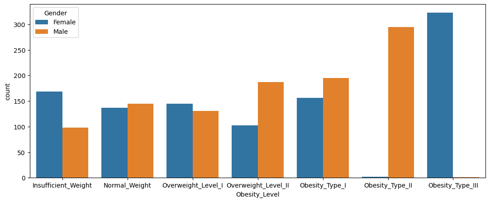

#### Family History of Overweight
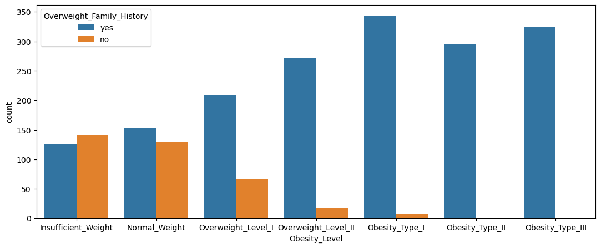

#### High Caloric Food Consumption
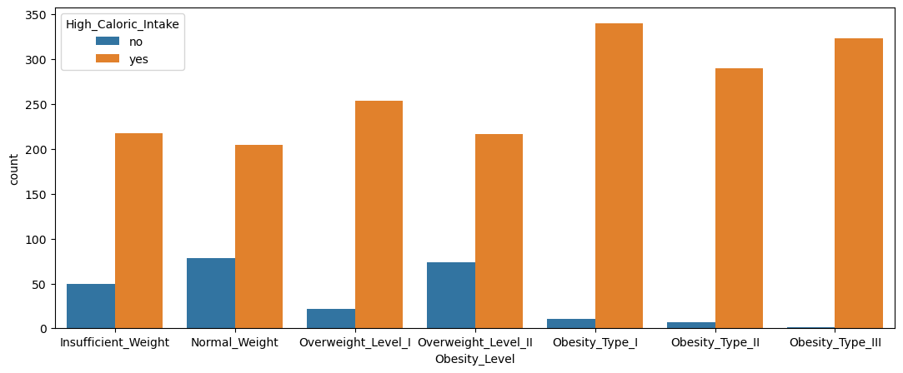

#### Other Categorical Variables
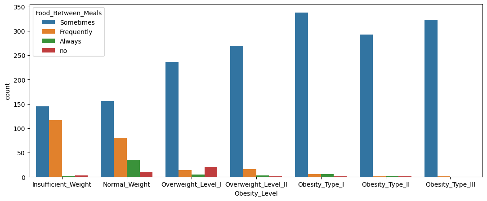

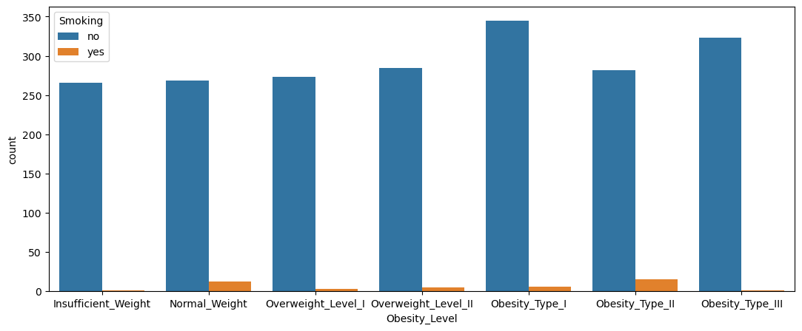

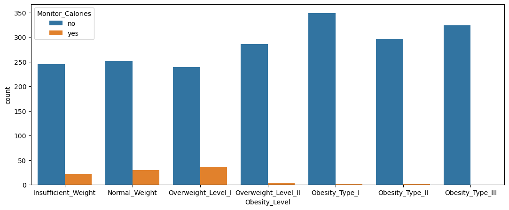

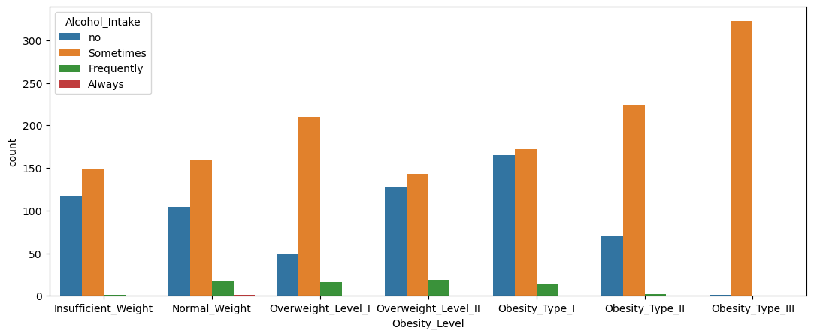

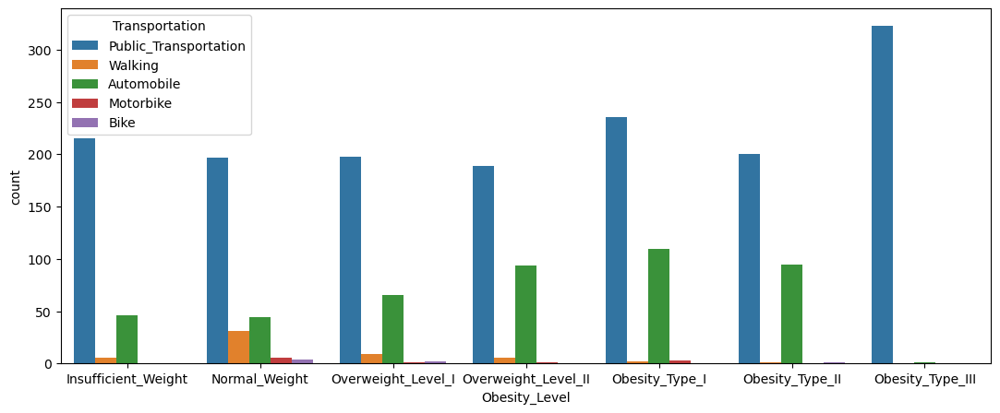

**Key Findings from Categorical Variables:**

1. **Gender Distribution**: 
   - Males showed higher representation in the Overweight Level II and Obesity Type I and II categories
   - Females had higher representation in Insufficient Weight, Normal Weight, and Obesity Type III categories
   - Distribution becomes more skewed toward specific genders as obesity levels increase

2. **Family History of Overweight**:
   - Strong association between family history and higher obesity levels
   - Individuals with family history were significantly more represented across all Overweight and Obesity categories
   - In Obesity Type I, II, and III categories, family history of overweight was present in ~90% of cases

3. **High Caloric Food Consumption (FAVC)**:
   - Frequent consumption of high-caloric foods strongly associated with higher obesity levels
   - In Obesity Type I, II, and III categories, "yes" responses dominated by a large margin
   - Low caloric intake ("no" responses) had higher representation in Normal and Insufficient Weight categories

4. **Food Between Meals (CAEC)**:
   - "Sometimes" consuming food between meals was the most common response across all obesity categories
   - "Frequently" responses decreased in higher obesity levels
   - "Always" and "no" responses were minimal across all categories

5. **Smoking Habits**:
   - Minimal variation across obesity levels, with non-smokers dominating all categories
   - Dataset contains very few smokers overall, limiting analysis of this variable

6. **Calorie Monitoring (SCC)**:
   - Strong pattern of not monitoring calories across all obesity categories
   - Some calorie monitoring present in lower obesity levels, particularly Normal Weight and Overweight Level I
   - Almost no calorie monitoring in higher obesity categories (Obesity Type I-III)

7. **Alcohol Consumption**:
   - "Sometimes" consuming alcohol was the most common response across all categories
   - "No" alcohol consumption increased slightly in higher obesity levels
   - "Frequently" responses were minimal and showed no clear pattern
   - Obesity Type III showed exclusively "Sometimes" responses

8. **Transportation Mode**:
   - Public transportation was the dominant mode across all obesity levels
   - Automobile usage increased in higher obesity categories
   - Walking and biking were minimally represented
   - Active transportation modes (walking, biking) virtually absent in highest obesity levels## Data Preprocessing

#

# Obesity Level Prediction Model


## Data Preprocessing

We implemented a comprehensive preprocessing pipeline to prepare the data for model training [here](data/Processing.ipynb), a summary of the results can be found below:

### Target Variable Encoding
- Applied Label Encoding to transform the categorical obesity levels into numerical values
- Created class mapping for interpretation: 
  ```
  Classes mapping: {
    'Insufficient_Weight': 0, 
    'Normal_Weight': 1, 
    'Obesity_Type_I': 2, 
    'Obesity_Type_II': 3, 
    'Obesity_Type_III': 4, 
    'Overweight_Level_I': 5, 
    'Overweight_Level_II': 6
  }
  ```
- Saved the label encoder for future use

### Train-Test Split
- Implemented a stratified split to maintain class distribution
- Allocated 80% of data for training (1,669 samples) and 20% for testing (418 samples)

### Feature Processing
- **Numerical Features**: Applied StandardScaler to normalize all numerical features
- **Categorical Features**: Applied OneHotEncoder with drop='first' to create binary features
- Created a unified preprocessing pipeline using ColumnTransformer
- Final feature space expanded from 16 original features to 23 processed features

### Data Persistence
- Saved preprocessed train/test data for reproducibility
- Preserved preprocessing pipeline for consistent transformation of new data
- Maintained metadata on feature mappings for model interpretability
  
## Exploratory Data Analysis

We performed initial data exploration to understand the structure and characteristics of the dataset:

### Dataset Overview
- **Size**: 2,087 observations with 17 features
- **Target Variable**: Obesity levels (NObeyesdad) - categorized into 7 classes
- **Features**: Mix of demographic (age, gender), anthropometric (height, weight), and behavioral/lifestyle variables

### Data Quality Assessment
- **Duplicates**: 24 duplicate entries were identified and removed
- **Missing Values**: No missing values were found in the dataset
- **Data Types**: Mix of numerical and categorical variables

### Feature Types
```
Identified 8 categorical columns: ['Gender', 'family_history_with_overweight', 'FAVC', 'CAEC', 'SMOKE', 'SCC', 'CALC', 'MTRANS']
Identified 8 numerical columns: ['Age', 'Height', 'Weight', 'FCVC', 'NCP', 'CH2O', 'FAF', 'TUE']
```

### Distribution Analysis

#### Boxplot Distribution
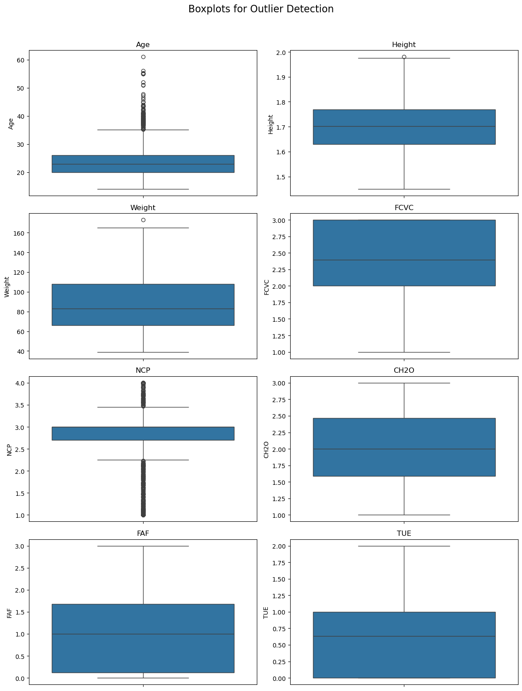

**Observations from Boxplots:**
- **Age**: Most individuals are between 20-26 years old, with outliers up to 61 years
- **Height**: Fairly normally distributed between 1.6m and 1.8m
- **Weight**: Most observations fall between 65kg and 110kg, with outliers up to 173kg
- **FCVC** (vegetable consumption): Skewed toward higher values (2-3)
- **NCP** (main meals): Majority at 3 meals per day, with some outliers at 1 and 4
- **CH2O** (water consumption): Fairly evenly distributed between 1.5-2.5 units
- **FAF** (physical activity): Skewed toward lower values, most between 0-1.6
- **TUE** (technology use): Most individuals reporting between 0-1 units

**Note**: We retained outliers as they represent real and important variations in the data that offer insights into specific cases or trends crucial for our analysis.

#### Histogram Distribution
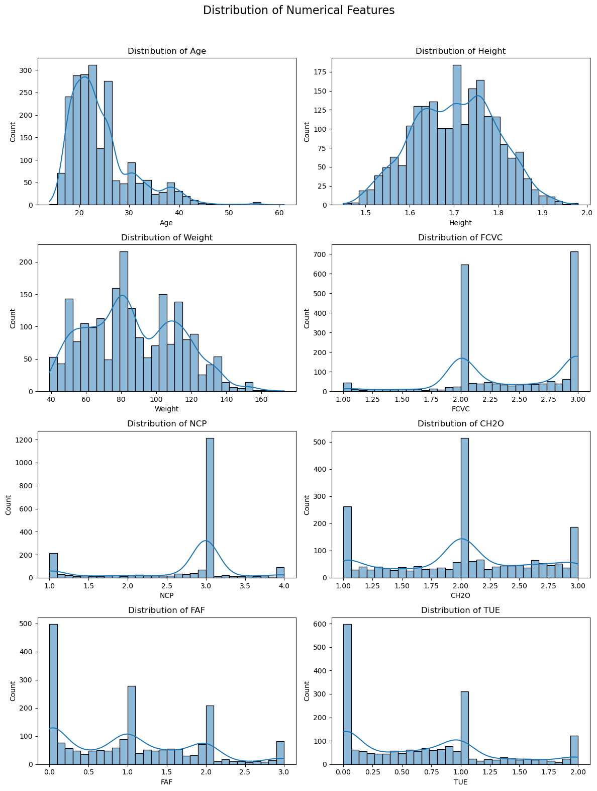

**Key Distribution Patterns:**
- **Age**: Right-skewed distribution with most participants between 18-25 years, and a long tail extending to 61 years
- **Height**: Approximately normal distribution centered around 1.7-1.75m
- **Weight**: Multimodal distribution with peaks around 55kg, 80kg, and 110kg, suggesting different weight groups in the dataset
- **FCVC** (vegetable consumption): Discrete values with strong peaks at 2.0 and 3.0, indicating most participants report moderate to high vegetable consumption
- **NCP** (main meals): Highly concentrated at value 3.0, showing most participants consume three main meals daily
- **CH2O** (water consumption): Peaks at 1.0 and 2.0, with a smaller peak at 3.0
- **FAF** (physical activity): Multimodal with major peaks at 0.0, 1.0, and 2.0, suggesting distinct patterns of physical activity (none, moderate, and frequent)
- **TUE** (technology use): Similar pattern to FAF with distinct groups at 0.0, 1.0, and 2.0

These distribution patterns reveal distinct behavioral profiles among participants and highlight the importance of considering both continuous variation and discrete groupings in our modeling approach.

### Summary Statistics
The dataset includes individuals with diverse characteristics:
- **Age**: Range from 14 to 61 years (mean: 24.4 years)
- **Height**: Range from 1.45m to 1.98m (mean: 1.70m)
- **Weight**: Range from 39kg to 173kg (mean: 86.9kg)

Key behavioral factors include:
- **Vegetable Consumption (FCVC)**: Mean of 2.42 (scale 1-3)
- **Main Meals (NCP)**: Mean of 2.70 (range 1-4)
- **Water Consumption (CH2O)**: Mean of 2.00 (scale 1-3)
- **Physical Activity (FAF)**: Mean of 1.01 (scale 0-3)
- **Technology Use (TUE)**: Mean of 0.66 (scale 0-2)

### Correlation Analysis

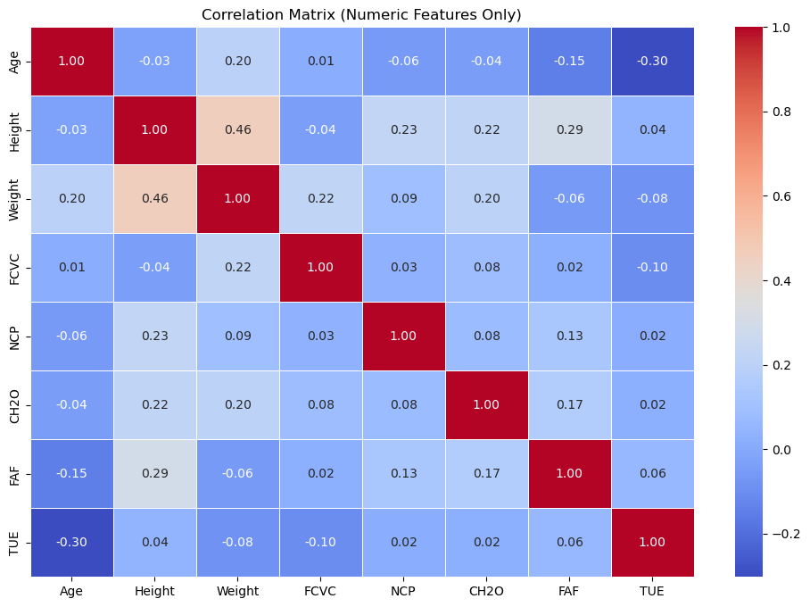

**Key Correlations:**
- **Height and Weight**: Moderate positive correlation (0.46), as expected
- **Age and Technology Use (TUE)**: Negative correlation (-0.30), suggesting younger individuals use technology devices more
- **Height and Physical Activity (FAF)**: Weak positive correlation (0.29)
- **Height and Number of Meals (NCP)**: Weak positive correlation (0.23)
- **Weight and Vegetable Consumption (FCVC)**: Weak positive correlation (0.22)

Most features show weak or negligible correlations, indicating that the numeric variables in this dataset do not have strong linear relationships. This suggests that our features are relatively independent, which can be beneficial for model robustness.

### Feature Abbreviations
- **FAVC**: Frequency of high-calorie food consumption
- **FCVC**: Frequency of vegetable consumption
- **NCP**: Number of main meals
- **CAEC**: Consumption of food between meals
- **CH2O**: Daily water consumption
- **SCC**: Calories consumption monitoring
- **FAF**: Physical activity frequency
- **TUE**: Time using technology devices
- **CALC**: Consumption of alcohol
- **MTRANS**: Transportation used
- **NObeyesdad**: Obesity level classification (target variable)

## Results

Implementtion of our model and relevant output can be found [here](models/baseline_enhanced.ipynb).  Our findings indicate that demographic and health-related factors can effectively predict obesity levels with high accuracy. Through comprehensive model evaluation and feature selection, we achieved the following key results:

1. **Model Performance**: Random Forest outperformed all other algorithms, achieving 96.17% accuracy on the test set after feature selection and hyperparameter tuning.

2. **Key Predictors**: The top predictive factors for obesity levels were:
   - Weight (29.52%)
   - Age (9.82%)
   - Height (9.12%)
   - Frequency of consumption of vegetables (8.89%)
   - Gender (6.00%)
   - Number of main meals per day (5.55%)
   - Physical activity frequency (4.96%)
   - Technology usage time (4.69%)
   - Water consumption (4.64%)
   - Family history of overweight (3.12%)

3. **Feature Selection Impact**: Feature selection improved performance for most models, particularly for Decision Trees (+1.20%) and Logistic Regression (+0.72%).  Analysis of feature importance can be found [here](data/Feature_Importance.ipynb). 

4. **Bias Analysis**: No significant age-related bias was detected in model predictions, with consistent accuracy across age quartiles.

What we see in the below confusion matrix is the model’s performance using all available features in the dataset.  Darker diagonal cells indicate correct classifications, while off-diagonal cells represent misclassifications.  The model is performing well overall but has some misclassifications, particularly in distinguishing Overweight Level I and Normal Weight.

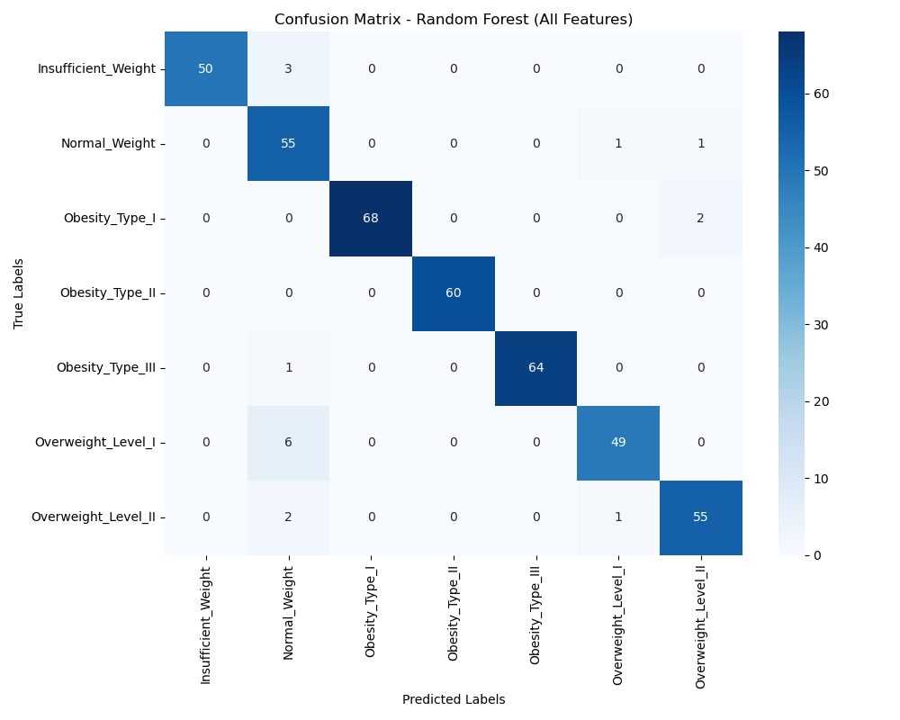

The below confusion matrix reveals the model’s performance after feature selection, where only the most important features were used.  The performance remains strong, and in some cases, misclassifications are reduced (e.g., Insufficient Weight and Normal Weight have fewer errors). Feature selection has not significantly reduced accuracy, meaning fewer features can achieve comparable results, improving efficiency.

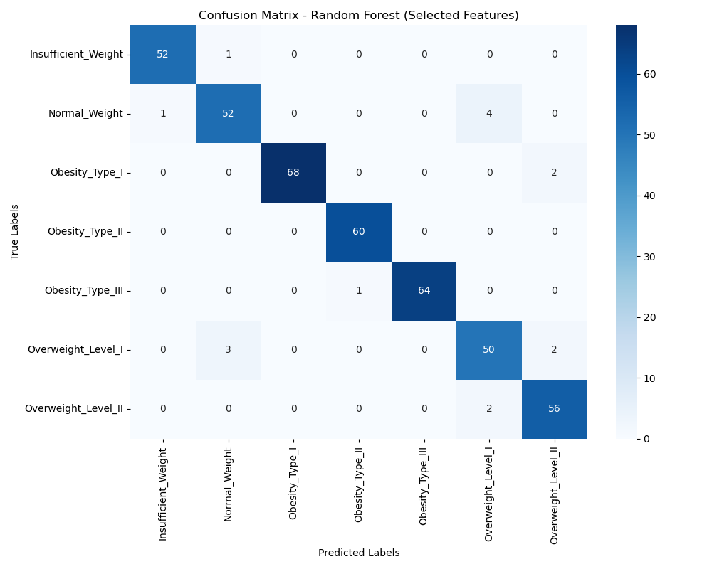

The following chart shows the most influential factors in predicting obesity levels using our Random Forest model.

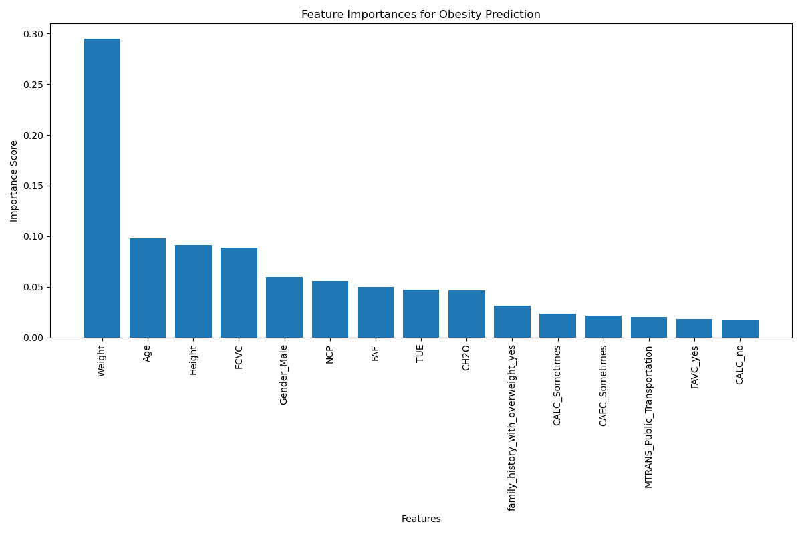

Weight is by far the most important predictor, contributing the most to the model’s decisions.  Age & Height also play a significant role, highlighting the natural relationship between body composition and obesity.  

Eating habits matter: FCVC (Frequency of Vegetable Consumption) and NCP (Number of Meals per Day) are among the top predictors.  

Physical activity is key: FAF (Frequency of Physical Activity) and TUE (Time Using Electronics/Screen Time) both contribute to obesity risk.  Other lifestyle factors, such as water intake (CH2O), family history of overweight, and alcohol consumption habits (CALC, CAEC), also have some influence.


## Model Evaluation

We evaluated six different machine learning models using 5-fold cross-validation, comparing their performance with all features and with selected features.

### Model Performance Comparison

| Model | All Features Accuracy | Selected Features Accuracy | Difference |
|-------|----------------------|---------------------------|------------|
| Random Forest | 95.93% | 96.17% | +0.24% |
| Decision Tree | 92.82% | 94.02% | +1.20% |
| Logistic Regression | 89.47% | 90.19% | +0.72% |
| Logistic Regression (Balanced) | 89.95% | 89.23% | -0.72% |
| KNN (k=5) | 83.97% | 80.14% | -3.83% |
| KNN (k=7) | 81.10% | 78.47% | -2.63% |


### Random Forest Performance (Best Model)

The Random Forest model with selected features achieved:
- Test accuracy: 96.17%
- Excellent performance across all obesity level classes:

| Class | Precision | Recall | F1-Score |
|-------|-----------|--------|----------|
| 0 | 0.98 | 0.98 | 0.98 |
| 1 | 0.91 | 0.91 | 0.91 |
| 2 | 1.00 | 0.97 | 0.99 |
| 3 | 0.98 | 1.00 | 0.99 |
| 4 | 1.00 | 0.98 | 0.99 |
| 5 | 0.91 | 0.91 | 0.91 |
| 6 | 0.93 | 0.97 | 0.95 |

### Hyperparameter Tuning

Hyperparameter tuning for the Random Forest model identified the following optimal parameters:
- n_estimators: 200
- max_depth: None
- min_samples_split: 2
- min_samples_leaf: 1

The tuned model maintained the same test accuracy (96.17%) as the untuned model with selected features.

### Cross-Validation Results

Cross-validation performance for the best model (Random Forest with selected features):
- Mean CV score: 95.33%
- Standard deviation: 1.03%

This indicates strong generalization capability and consistency across different data partitions.

### Ethical Considerations

We also conducted an analysis of ethical factors with the following findings:
1. We did not detect any significant age-related bias (accuracy was consistent across age quartiles).
2. Privacy considerations should be addressed for this dataset as it pertains to people's health information.
3. One should consider the results as a supportive tool and not a replacement for medical advice.

### Conclusion

The Random Forest model with selected features provided a robust tool for predicting obesity levels based on demographic and health-related factors. The model's high accuracy and balanced performance across classes make it suitable for real-world applications in healthcare and wellness programs, with appropriate ethical safeguards.


## Folder Structure
```
/project_root  
│── data/                  # Raw & processed data  
│── notebooks/             # Jupyter Notebooks for EDA, modeling  
│── src/                   # Scripts (data processing, model training)  
│── reports/               # Visualizations, findings  
│── models/                # Saved models  
│── requirements.txt       # Dependencies  
│── README.md              # Project summary  
│── .gitignore             # Exclude large files  
```

## Dependencies
Install required packages using:
```bash
pip install -r requirements.txt
```

## Contributors

| Name                | GitHub Account                               | Reflection Video                      |
| ------------------- | -------------------------------------------- | ------------------------------------- |
| **Laura MacKew**    | [@l-mack](https://github.com/l-mack)         | [Video](INPUT LINK HERE)              |
| **Mahdi Zargaran**  | [@mxzargaran](https://github.com/mxzargaran) | [Video](INPUT LINK HERE)              |
| **Mohsen Ghaffari** | [@mohghaff](https://github.com/mohghaff)     | [Video](https://youtu.be/mBV62Mfe68w) |
| **Prashant Baisla** | [@pbaisla](https://github.com/pbaisla)       | [Video](INPUT LINK HERE)              |
| **Whitney Mak**     | [@wmak-eng](https://github.com/wmak-eng)     | [Video](INPUT LINK HERE)              |

## Acknowledgments
- Data sourced from UCI Machine Learning Repository
- University of Toronto Data Science Institute guidance

## Presentation
Please find a link to slides used in a presentation of these findings [here](https://docs.google.com/presentation/d/1cOd0nBYNI-o0RPnFu9SHcvhsmV9YmuPeFJKVdAxhK5c/edit?slide=id.g342b201c8ea_0_188#slide=id.g342b201c8ea_0_188). 
  

## References
Centers for Disease Control and Prevention. (2022). Adult obesity facts. U.S. Department of Health & Human Services. https://www.cdc.gov/obesity/data/adult.html

World Health Organization. (2023). Obesity and overweight. https://www.who.int/news-room/fact-sheets/detail/obesity-and-overweight
